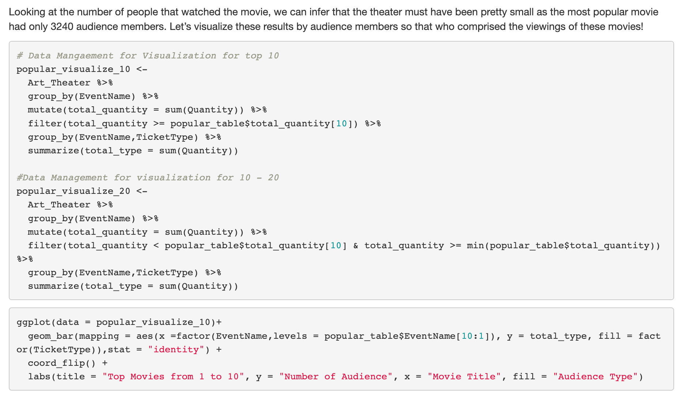

# Data Analysis

This repository is for storing many short data analysis done using data. 
Currently it includes analysis on Chicago food vendors, covid-19, and local Champaign data.
They all use problem, plan, data, analysis, conclusion (PPDAC) cycle for its analysis.
All the files are created by using R and R markdown

## Local Theather 

Analyzing and investigating one of the closed down Champaign theaters to see which shows were popular in this local region, and what potentially might have been the reason for its closure.

## Chicago Food Vendor

Analyzing and investigating different safety levels of various food vendors in Chicago. Safety Levels are important, especially among food vendors! Through different methods, several investigative cycles are used to come up with accurate, data-driven interpretations and conclusions.

## Covid-19 Analysis

Analyzing and investigating the claims that the President of the United States have been making in regards to the global pandemic.

 
